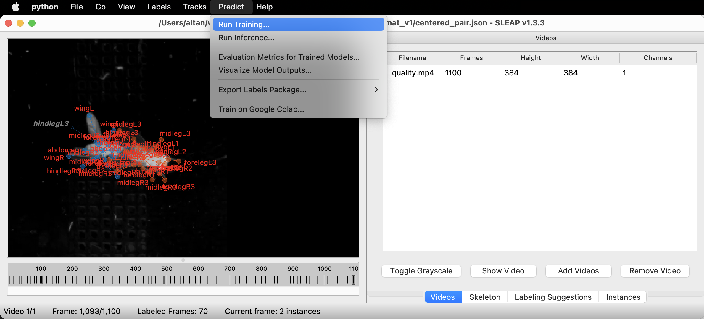
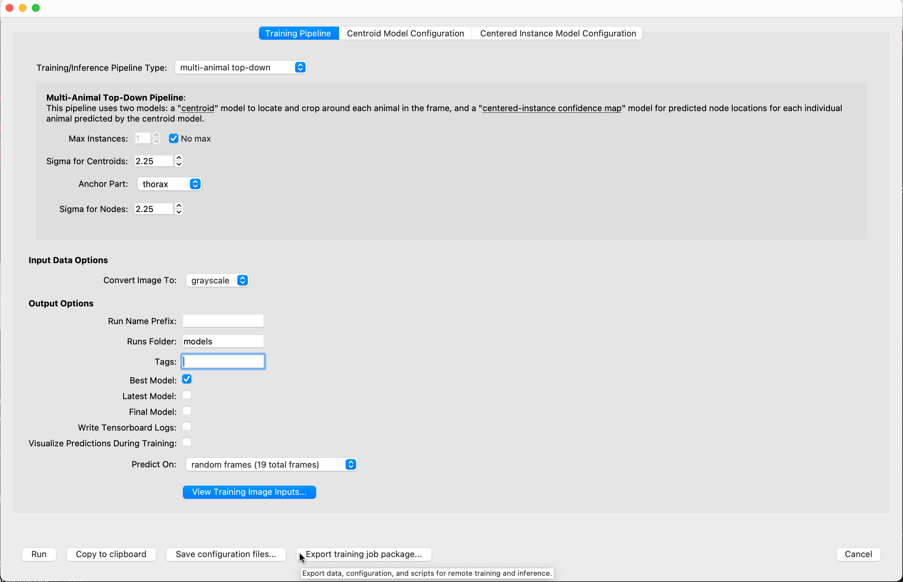
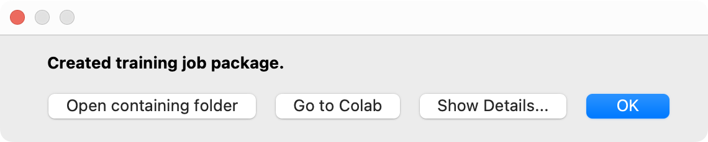
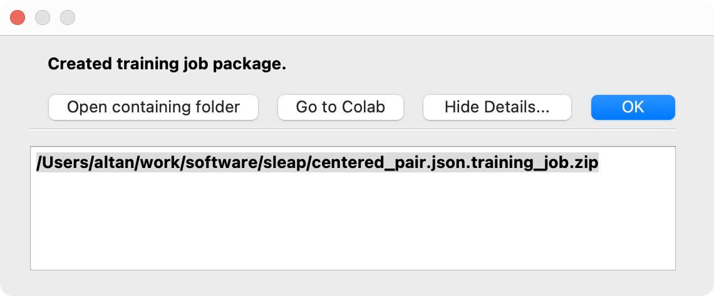

# sleap-container

This a [container](https://apptainer.org/) to run [SLEAP](https://sleap.ai) jobs on the University of Washington [Hyak](https://hyak.uw.edu) cluster. You can use this container to run SLEAP training and prediction jobs on Hyak in a GPU-accelerated environment.
s, which provide reproducible environments that can run anywhere and be shared with other researchers.

## Prerequisites

Before running this container, you'll need the following:

- A Linux, macOS, or Windows machine
- An SSH client (usually included with Linux and macOS, and available for Windows through the built-in SSH client on Windows 10+, [WSL2](https://learn.microsoft.com/en-us/windows/wsl/install) or [Cygwin](https://www.cs.odu.edu/~zeil/cs252/latest/Public/loggingin/cygwin.mmd.html)).
- [Hyak](https://hyak.uw.edu) Klone access with compute resources

Follow the instructions below to set up your machine correctly:

### Installing SSH

#### Linux

If you are using Linux, OpenSSH is probably installed already -- if not, you can install it via `apt-get install openssh-client` on Debian/Ubuntu or `yum install openssh-clients` on RHEL/CentOS/Rocky/Fedora. To open a terminal window, search for "Terminal" in your desktop environment's application launcher.

#### macOS

If you're on macOS, OpenSSH will already be installed. To open a terminal window, open `/Applications/Utilities/Terminal.app` or search for "Terminal" in Launchpad or Spotlight.

#### Windows

On Windows 10+, you can [use the built-in SSH client](https://learn.microsoft.com/en-us/windows/terminal/tutorials/ssh). You may also install a SSH client through [WSL2](https://learn.microsoft.com/en-us/windows/wsl/install) or [Cygwin](https://www.cs.odu.edu/~zeil/cs252/latest/Public/loggingin/cygwin.mmd.html) (not recommended, needs additional setup). See the links for instructions on how to install these. You can start a terminal window by searching for "Terminal" in the Start menu.

### Setting up SSH keys to connect to Hyak compute nodes

Before you are allowed to connect to a compute node where your SLEAP job will be running, you must add your SSH public key to the authorized keys on the login node of the Hyak Klone cluster.

If you don't, you will receive an error like this when you try to connect to the compute node:

```text
Permission denied (publickey,gssapi-keyex,gssapi-with-mic)
```

To set this up quickly on Linux, macOS, or Windows (WSL2/Cygwin), open a new terminal window **on your machine** and enter the following 2 commands before you try again. Replace `your-uw-netid` with your UW NetID:

```bash
[ ! -r ~/.ssh/id_rsa ] && ssh-keygen -t rsa -b 4096 -N '' -C "your-uw-netid@uw.edu" -f ~/.ssh/id_rsa
ssh-copy-id -o StrictHostKeyChecking=no -i ~/.ssh/id_rsa your-uw-netid@klone.hyak.uw.edu
```

See the [Hyak documentation](https://hyak.uw.edu/docs/setup/intracluster-keys) for more information.

### Set up the Apptainer cache directory on Hyak `klone`

Apptainer containers can take up several gigabytes of space each. By default, Apptainer will store cached containers in your home directory (`~`), under  `~/.cache/apptainer`. However, because home directory space on Hyak is limited to 10 GiB per user, you may want to set up a different cache directory.

We advise setting up a cache directory under the `/tmp` directory or in the [scrubbed](https://hyak.uw.edu/docs/storage/gscratch/) directory, under `/gscratch/scrubbed/your-uw-netid`. To set this up, first connect to `klone.hyak.uw.edu` via SSH:

```bash
ssh your-uw-netid@klone.hyak.uw.edu # Replace your-uw-netid with your UW NetID
```

Once you're logged in, create a directory for the cache and set the `APPTAINER_CACHE_DIR` environment variable to point to it:

```bash
mkdir -p "/gscratch/scrubbed/$USER/apptainer-cache" && export APPTAINER_CACHE_DIR="/gscratch/scrubbed/$USER/apptainer-cache"
```

Finally, add the following line to your `~/.bashrc` file (or `~/.zshrc` if you use ZSH) to retain this setting across multiple logins:

```bash
echo "export APPTAINER_CACHE_DIR=\"/gscratch/scrubbed/$USER/apptainer-cache\"" >> ~/.bashrc
```

## Usage

This guide assumes that you are running SLEAP on your own machine, with an open SLEAP project that you are ready to start training on. If you need help creating a SLEAP project, consult the [SLEAP documentation](https://sleap.ai/tutorials/tutorial.html).

To start training your model on the cluster, you must first create a *training package*:

> A self-contained **training job package** contains a .slp file with labeled data and images which will be used for training, as well as .json training configuration file(s). [*](https://sleap.ai/notebooks/Training_and_inference_using_Google_Drive.html)

### Exporting a training package

You can create a training job package in the `sleap-label` GUI by following the `Run Training...` option under the `Predict` menu:


Set the parameters for your training job (refer to [SLEAP documentation](https://sleap.ai/tutorials/initial-training.html) if you're not sure), and click `Export training job package` once you're done:


Next, you should see a dialog that says, `Created training job package.` Click `Show Details...`:


The full file path to the training package will be displayed (e.g., `/home/me/sleap/my_training_job.zip`). Select and copy this path:


### Uploading a training package to the cluster

Now you must use the terminal on your computer to upload the training package to the Hyak cluster. You can find instructions on how to set up your terminal to access Hyak [here](https://uw-psych.github.io/compute_docs/hyak/start/connect-ssh.html).

Open a terminal window **on your computer** and enter the following command to copy the training package to your home directory (`~`) on the cluster:

```bash
scp /home/me/sleap/my_training_job.zip your-uw-netid@klone.hyak.uw.edu: # Replace your-uw-netid with your UW NetID
```

*NOTE: You may need to log in with your UW NetID and two-factor authentication.*

### Runnning the training package on the cluster

Once the file has been copied, log in to the cluster via SSH:

```bash
ssh your-uw-netid@klone.hyak.uw.edu # Replace your-uw-netid with your UW NetID
```

#### Extracting the training package

The training package should be located in your home directory on `klone`. You can check by running `ls`:

```bash
ls *.zip # Should display all ZIP files in directory, including `my_training_job.zip`
```

Unzip the package file to a new directory. Let's call it `training_job`:

```bash
unzip my_training_job.zip -d training_job
```

#### Allocating a node on the cluster

We are almost ready to launch the container. First, though, we need to allocate a job on the cluster. We will use the `salloc` command to do this.

The following command will allocate a job on one node with 4 GPUs, 64 GB of memory, and 8 CPUs for 24 hours on the `gpu-a40` partition available to the `escience` account. You can adjust these parameters as needed. For more information on the `salloc` command, see [this page](hhttps://uw-psych.github.io/compute_docs/hyak/compute/slurm/slurm.html) and the [salloc documentation](https://slurm.schedmd.com/salloc.html).

```bash
salloc --job-name sleap-train-test \
    --account escience \
    --partition gpu-a40 \
    --gpus 4 \
    --ntasks 1 \
    --gpus-per-task=4 \
    --mem 64G \
    --cpus-per-task 4 \
    --time 24:00:00
```

When the allocation is ready, `salloc` will tell you what node it is running on, e.g.:

```text
salloc: Granted job allocation 15001744
salloc: Waiting for resource configuration
salloc: Nodes g3052 are ready for job
```

Take note of the node, in this case `g3052`. We will need it in the next step.

If you forget, you can run `squeue` to see the status of your job:

```bash
 squeue --me | grep sleap
```

This will show you the status of your job, including the node it is running on:

```text
15001744   gpu-a40 sleap-tr    your-uw-netid  R       5:26      1 g3052
```

#### Running SLEAP on the compute node

Now we are ready to start SLEAP. First, we need to connect to the node where our job is running. We do this with the `ssh` command to the node we noted earlier (in this example, `g3052`):

```bash
ssh g3052
```

If you have problems connecting to the node, it's possible that you haven't set up your SSH keys correctly. See the **Prerequisites** section or the [Hyak documentation](https://hyak.uw.edu/docs/setup/intracluster-keys) for more information.

##### Verifying GPU access

Once you are connected to the node, you can verify that the SLEAP container has access to the GPUs by running the following command:

```bash
apptainer run --nv oras://ghcr.io/maouw/sleap-container:latest python -c "import sleap; sleap.system_summary()"
```

You should get output that looks something like this:

```text
GPUs: 4/4 available
  Device: /physical_device:GPU:0
         Available: True
        Initalized: False
     Memory growth: None
  Device: /physical_device:GPU:1
         Available: True
        Initalized: False
     Memory growth: None
  Device: /physical_device:GPU:2
         Available: True
        Initalized: False
     Memory growth: None
  Device: /physical_device:GPU:3
         Available: True
        Initalized: False
     Memory growth: None
6.40s user 6.24s system 88% cpu 14.277s total
```

##### Training the model

Now, navigate to the directory where you unzipped the training package:

```bash
cd ~/training_job
```

The next step is to launch the container:

```bash
apptainer run --nv oras://ghcr.io/maouw/sleap-container:latest bash train-script.sh
```

Apptainer will download the container image from GitHub and launch it on the node. The option `--nv` enables Nvidia GPU support. Once the container has launched, it will instruct `bash` to run the script `train-script.sh`. This script will start the training job.

During training, you will see a lot of output in the terminal. After some time, if training is successful, the last of the output should look something similar to this:

```text
INFO:sleap.nn.evals:Saved predictions: models/231009_165437.centered_instance/labels_pr.train.slp
INFO:sleap.nn.evals:Saved metrics: models/231009_165437.centered_instance/metrics.train.npz
INFO:sleap.nn.evals:OKS mAP: 0.205979
Predicting... ━━━━━━━━━━━━━━━━━━━━━━━━━━━━━━━━━━━━━━━━ 100% ETA: 0:00:00 3.3 FPS
INFO:sleap.nn.evals:Saved predictions: models/231009_165437.centered_instance/labels_pr.val.slp
INFO:sleap.nn.evals:Saved metrics: models/231009_165437.centered_instance/metrics.val.npz
INFO:sleap.nn.evals:OKS mAP: 0.064026
229.63s user 44.64s system 77% cpu 5:53.45s total
```

Once training finishes, you'll see a new directory (or two new directories for top-down training pipeline) containing all the model files SLEAP needs to use for inference:

```bash
ls models/
```

```text
231009_165437.centered_instance  231009_165437.centroid
```

You can use these model files to run inference on your own computer, or you can run inference on the cluster (consult the [SLEAP documentation](https://sleap.ai/guides/remote.html) for more information).

### Downloading the model

To copy the model files back to your computer, in a terminal where you are logged into `klone.hyak.uw.edu`, compress the model directory with `zip`:

```bash
cd ~/training_job
zip -r trained_models.zip models
```

Then, in a new terminal window *on your own computer*, use the `scp` command to copy the model files from `klone` to your computer:

```bash
scp your-uw-netid@klone.hyak.uw.edu:~/training_job/trained_models.zip . # Replace your-uw-netid with your UW NetID
```

This will copy the file `trained_models.zip` to your current directory. You can then unzip the file and use the model files for inference on your own computer. Consult the [SLEAP documentation](https://sleap.ai/guides/remote.html) for more information on running inference with a trained model.

### Ending the cluster job

**Be sure to end your cluster job when you are done!** This will free up resources for other users and potentially prevent you from being charged for time you are not using.

To do this, go back to the terminal where you were running SLEAP on the cluster. (If you closed the terminal, you can log back in to the cluster with `ssh klone.hyak.uw.edu`.)

**If you're still logged in to the compute node**, exit:

```bash
exit
```

Cancel the job allocation with the `scancel` command:

```bash
scancel --me --jobname sleap-train-test
```

Finally, exit the cluster:

```bash
exit
```

SLEAP well!
